# Analysis & Visualization of Ride-sharing Data
## 1 Overview of Project

The purpose of the project was to create a summary of the ride-sharing data by city type for PyBer, a ride-sharing app company. This was accompished using Pandas to create tabular views and Matplotlib to create a multiple-line graphical view of the total weekly fares for each city type. The project columnated in creating this report that summarizes how the data differs by city type and how those differences can be used by decision-makers at PyBer.

## 2 Approach and Analysis

### 2.1 Input Data Provided

We were provided with two csv files from from which to conduct our analysis.  The first file consists of data about the city, drivers and types of cities.  You can see from the code below that the types consist of Urban, Suburban and Rural.

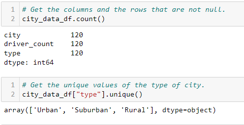

***Figure 1 - Input file of City Data***

In figure 2, below you can see the ride data than consists of 2375 records of individual ride that have been provide through Pyber.

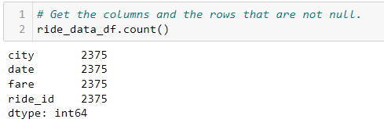

***Figure 2 - Input file of Ride Data***

You will notice that the two data sets have a common data item "city".  Using this common piece of information we were able to create a merged DataFrame that would allow us to conduct further analysis.  The merge data is presented in Table 1 below.

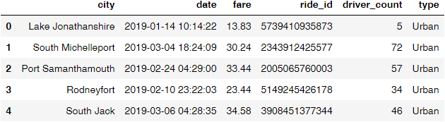

***Table 1 - DataFrame of Merged Input Data***

### 2.2 Analysis of Data

In this section we looked at the merged data to extract columns of interest.  You will notice in the code that I actually first generated many of the numbers individually, which served as confirmation that the structure of code that grabbed the complete columns was correct.  The code in figure 3 below was used to extract a column of data representing the total fares for each type of city. 

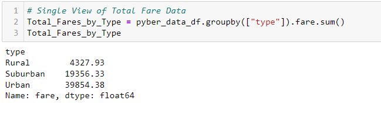

***Figure 3 - Creation of Columns***

In figure 4 below I show two ways that the average fare was calculated.  The first that actual goes through all the transactions and calculates the mean and then the second (superior) method that simply divides two columns that had already been calculated.  Both methods, as expected, provide the same results.

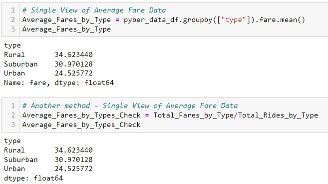

***Figure 4 - Working with Columns***

The results for each of the columns were then assembled into a single DataFrame indexed on city type.  The view of this data, by city type, has been appropriately formatted for presentation as can be seen in table 2 below.

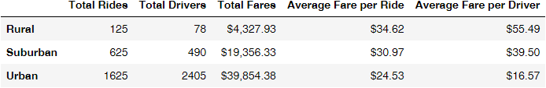

***Table 2 - Summary View of PyBer Data***

### 2.3 Visualization of Time Series Data

This part of the analysis was intended to provide PyBer with a visual representation of the ride data that was provided.  Table 3 shows the first 10 rows of data in the merged DataFrame "pyber_data_df".

***Table 3 - First 10 Rows of PyBer Data***

Table 4 shows the last 10 rows of data in the merged DataFrame "pyber_data_df".  You will notice that the dates are not in order and in fact not all city types have data for all dates.  There are a total of 2374 ride entries in the data provided.

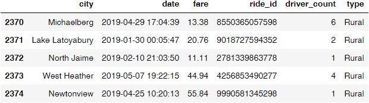

***Table 4 - Last 10 Rows of PyBer Data***

In figure 5 below is s screen shot from the code that shows us grouping the pyber data with a type and date index and summing. 

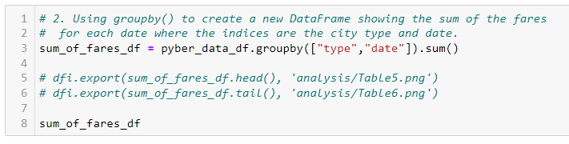

***Figure 5 - Grouping and Summing***

View the data by groupby type and then by that is shown in table 5 for the first ten rows and table 6 as the last 10 rows.

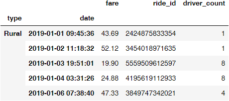

***Table 5 - Group by Type and Date First 10 Rows***

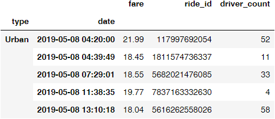

***Table 6 - Group by Type and Date Last 10 Rows***

In preparation for a graphical representation of the ride data the index was reset and a pivot table index by date was created.  The columns were set to the city types and the value were set to fares collected.  

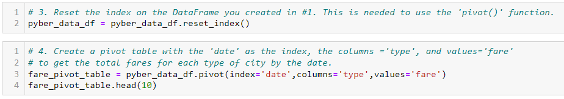

***Figure 6 - Creating Pivot Table***

You will also notice, in table 7 below, that the date range was set to a specific four months of interest and the data was summed into weekly bins.

  

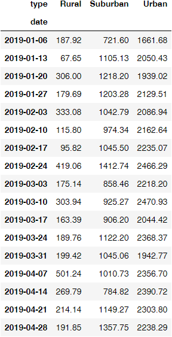

***Table 7 - Weekly Fares by City Type***

The Matplotlib library was then called, providing a much clearer presentation of the weekly ride data for analysis.

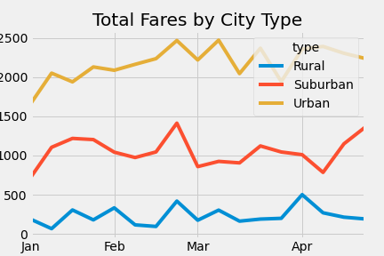

***Figure 7 - Total Weekly Fares by City Type***

## 3 Summary of PyBer Ride Analysis

The summary below is represented mainly in Table 2 - Summary View of PyBer Data and  figure 7 - Total Weekly Fares by City Type.  

Here are the highlights for the analysis for the data provide by PyBer.

- There is no discernible trend from month to month, if PyBer would like to determine season trend a longer data set is required.
- Total revenue by  type of city is much greater in urban city and quit small in rural areas.
- As expected the average ride fare is larger in rural communities due to the likelihood of larger distances.
- They is a very large disparity in the average fare per driver with rural drivers seeing more than four times that of urban drivers.

It may be worth long at other data to determine what if any adjustment need to be made for PyBer.  Here are some thoughts to consider.

- How quickly does PyBer provide service to clients in different city type, i.e. do rural clients need to wait too long for a ride.
- How satisfied are PyBer drivers with the money they make driving for PyBer, i.e. are there too many urban drivers

It's a difficult task to correctly balance the needs of the clients, the drivers and the company but it needs to be done if PyBer wants to continue to grow in the ride share market place.  I would recommend further investigation supported by additional information.

